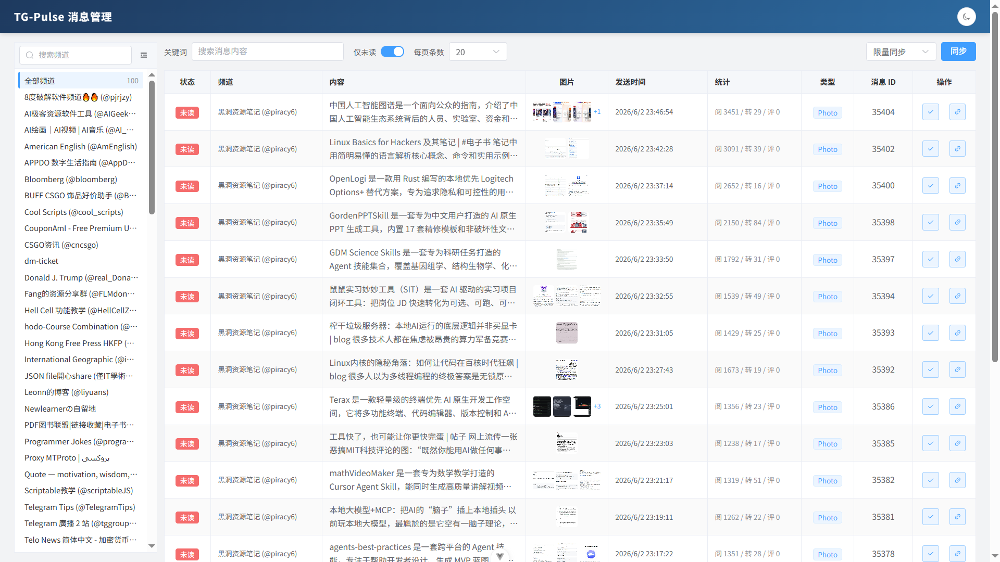
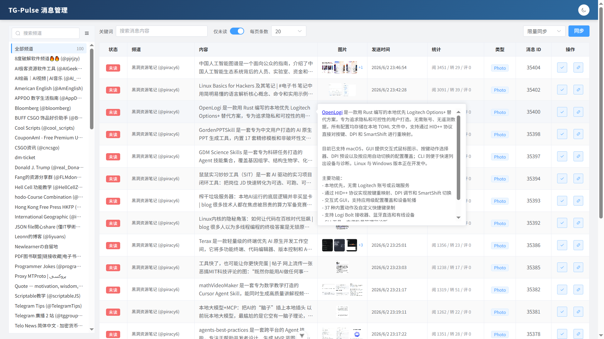
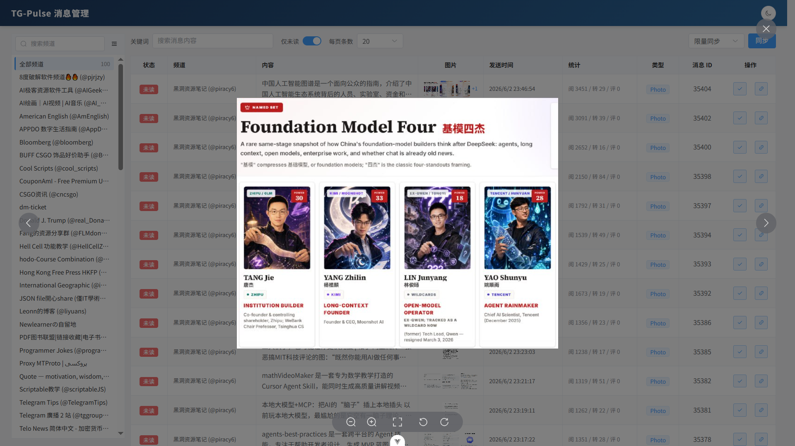
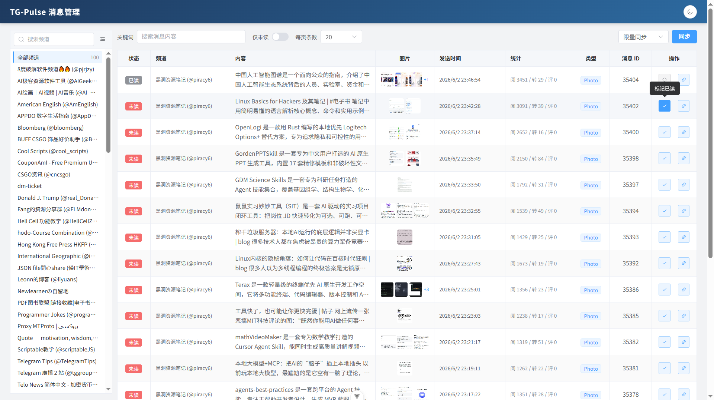

# TG Reader

**语言：** [English](README.md) | 简体中文

TG Reader 是一个个人使用的 Telegram 广播频道阅读器。它会从已登录的 Telegram 账号刷新频道列表，按需同步指定频道，并提供一个 Web 界面用于阅读、筛选、图片预览和已读/未读管理。

## 功能特性

- 从当前 Telegram 账号刷新广播频道列表。
- 按需同步选中的单个频道；页面加载时不会自动同步消息。
- 按频道、关键词、未读状态和每页数量浏览本地消息。
- 浏览全部频道时显示消息来源频道。
- 通过 `/images/{channel_id}/{message_id}.jpg` 懒加载 Telegram 图片。
- 使用 `(channel_id, message_id)` 存储消息，避免多频道消息 ID 冲突。

## 截图

带频道侧边栏、筛选器、已读状态和图片缩略图的消息列表：



长消息内容悬停预览：



带图库导航的图片灯箱：



已读状态操作和 Telegram 链接快捷入口：



## 技术栈

- 后端：FastAPI、SQLAlchemy async、Pydantic、Telethon
- 前端：Vue 3、TypeScript、Vite、Element Plus
- 数据库：PostgreSQL

## 合理使用

TG Reader 通过 Telethon 使用官方 Telegram API，并且只读取当前登录账号可访问的频道。它的定位是个人阅读、筛选和本地消息管理工具。

请不要使用本项目重新分发频道内容、绕过访问限制、镜像 Telegram 频道，或将 Telegram 数据用于 AI 训练等未经授权的用途。使用者需要自行遵守 Telegram 条款，并尊重频道所有者的相关权利。

## 配置说明

仓库只提交一个公开的环境变量模板：

```text
.env.example
```

从模板创建你的私有 Docker 配置：

```bash
cp .env.example .env
```

然后编辑 `.env`，填写你自己的配置：

```env
POSTGRES_USER=tg_reader
POSTGRES_PASSWORD=change_me
POSTGRES_DB=tg_reader

API_ID=
API_HASH=
SESSION_NAME=telegram_session
```

你可以从 Telegram 开发者账号获取 `API_ID` 和 `API_HASH`：

https://my.telegram.org/apps

Docker Compose 会自动读取根目录的 `.env`，所以 Docker 命令不需要额外添加 `--env-file`。不要提交 `.env`、`.env.local`、`backend/.env.local`、`frontend/.env.local` 或 Telethon 的 `*.session` 文件。

## Docker 使用

先构建后端镜像，然后创建 Telegram session：

```bash
docker compose build backend
docker compose run --rm backend uv run python scripts/login_telegram.py
```

启动所有服务：

```bash
docker compose up -d --build
```

停止所有服务：

```bash
docker compose down
```

重置 Docker 数据库和卷：

```bash
docker compose down -v
```

Docker 服务说明：

- `db`：PostgreSQL
- `backend`：FastAPI API，宿主机端口为 `8000`
- `frontend`：由 nginx 提供服务的 Vue 应用，宿主机端口为 `80`

前端容器会将 `/api/` 和 `/images/` 代理到后端服务。Docker 会把 Telegram session 存储在 `telegram_session` 卷中，把图片缓存存储在 `backend_images` 卷中。

## 本地开发

本地开发时继续使用根目录 `.env` 作为共享基础配置。如果你需要本地私有覆盖配置，后端会额外读取 `backend/.env.local`，Vite 会读取 `frontend/.env.local`。

在仓库根目录启动 PostgreSQL：

```bash
docker compose up -d db
```

启动后端：

```bash
cd backend
uv sync
uv run python main.py
```

在另一个终端启动前端：

```bash
cd frontend
pnpm install
pnpm dev
```

默认本地地址：

- 前端：`http://localhost:5173`
- 后端 API：`http://localhost:8000`
- Swagger UI：`http://localhost:8000/docs`

如果需要把 Vite 开发服务器绑定到指定局域网地址，可以创建或编辑 `frontend/.env.local`：

```env
VITE_DEV_HOST=0.0.0.0
VITE_DEV_PORT=5173
VITE_API_BASE=http://localhost:8000/api
VITE_IMAGE_BASE=http://localhost:8000
```

## 使用流程

1. 打开前端页面。
2. 等待频道侧边栏从当前登录的 Telegram 账号加载频道。
3. 选择一个频道。
4. 点击同步，导入当前频道的消息。
5. 使用频道、关键词、未读状态和每页数量筛选本地消息。

## 检查命令

后端：

```bash
cd backend
uv run python -m compileall api config crud dao model service scripts main.py
```

前端：

```bash
cd frontend
pnpm type-check
pnpm build-only
pnpm lint
```

Docker Compose：

```bash
docker compose config --quiet
```

## License

MIT
